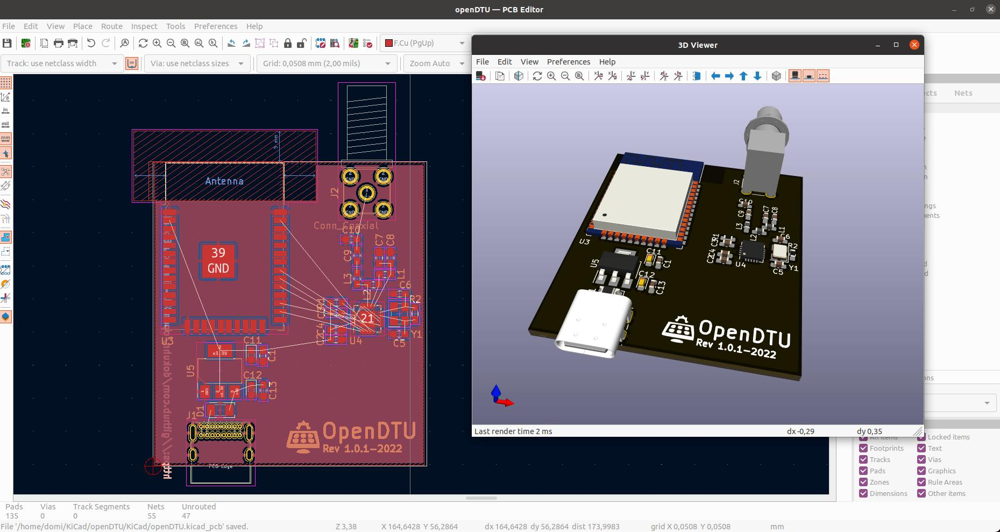

# openDTU Breakout Board

 [![CC BY-NC-SA 4.0][cc-by-nc-sa-shield]][cc-by-nc-sa]

To read Hoymiles inverters there is a nice project called [OpenDTU](https://github.com/tbnobody/OpenDTU) which uses an ESP32 to talk to them. 

 

To extend this project with a hardware component this small KiCAD board was created. With it it should be possible for the not experienced in soldering person to build an own OpenDTU easier. But also the possibility to add further ideas, like temperature sensors, display etc.. In a second step it is also possible to design a board with all the necessary components on it directly. 

 

The first batch of 10 pieces is partially built and tested. Further tests will follow. Extensions of the board will be maintained in a second branch. 

## Renderings

## Development

As described in the previous section, extensions or development stages are maintained in a separate branch. This section is to show exemplarily where the current developments are. Currently a SMD/SMT variant of the board is designed (see picture with the first placement). The SMT will make the board much smaller of course, so it will fit into small cases. All needed components for operation will be on the board. The rogramming interface will be connected externally by pin headers, for example. 

## License 

This work is licensed under a
[Creative Commons Attribution-NonCommercial-ShareAlike 4.0 International License][cc-by-nc-sa].

[![CC BY-NC-SA 4.0][cc-by-nc-sa-image]][cc-by-nc-sa]

[cc-by-nc-sa]: http://creativecommons.org/licenses/by-nc-sa/4.0/
[cc-by-nc-sa-image]: https://licensebuttons.net/l/by-nc-sa/4.0/88x31.png
[cc-by-nc-sa-shield]: https://img.shields.io/badge/License-CC%20BY--NC--SA%204.0-lightgrey.svg

