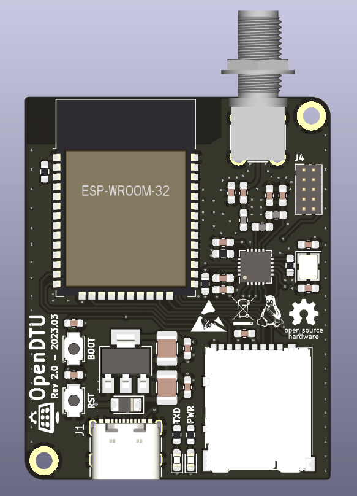

# openDTU Breakout Board

 [![CC BY-NC-SA 4.0][cc-by-nc-sa-shield]][cc-by-nc-sa]

To read Hoymiles inverters there is a nice project called [OpenDTU](https://github.com/tbnobody/OpenDTU) which uses an ESP32 to talk to them. 

 

To extend this project with a hardware component this small KiCAD board was created. With it it should be possible for the not experienced in soldering person to build an own OpenDTU easier. But also the possibility to add further ideas, like temperature sensors, display etc.. In a second step it is also possible to design a board with all the necessary components on it directly. 

 

The first batch of 10 pieces is partially built and tested. Further tests will follow. Extensions of the board will be maintained in a second branch. 

## Donations

As you can see I am in the process of developing a SMT/SMD variant. To support the first 10-25 prototype boards you are welcome to make a donation. This donation should be used to compensate the material costs for components, boards and consumables (soldering paste, etc.). Through my membership in the [Linux User Group Saar e.V.](https://lugsaar.de/) you support more than just me, you also support our community in similar creative and technical projects in the open source and open hardware domain. 

-PayPal: 

## Renderings

## Development

As described in the previous section, extensions or development stages are maintained in a separate branch. This section is to show exemplarily where the current developments are. Currently a SMD/SMT variant of the board is designed (see picture with the first placement). The SMT will make the board much smaller of course, so it will fit into small cases. All needed components for operation will be on the board. 

### New Features:

- All components on just one board
- Stable voltage supply
- MicroSD slot with support for a small file system to store e.g. measurement series (CSV or JSON files)
- USB-C (now more common than microUSB)
- Option to connect a small (I2C) display

##  Hardware you need

### ESP32 board

In principle, the hardware recommended [here](https://github.com/tbnobody/OpenDTU) has been used in this project. Unfortunately there are many different variants, especially in the MCU boards, so that you must be very careful that your board is pin-compatible with the following figure. 

[figure source](https://i0.wp.com/www.teachmemicro.com/wp-content/uploads/2020/06/NodeMCU-32S-Pinout.jpg?ssl=1)

### Capacitor

As you can see in the graphics above, an electrolytic capacitor is placed between the two boards. This capacitor should be as close as possible to the NRF24L01+ radio board. The size of the capacity should not be larger than 100 uF, typically capacity like 10uF or 22uF are recommended. This also corresponds to the typical capacity in the AP1117 datasheets (keep in mind that the noboard capacity of the ESP32 board has to be added). The voltage stability has to be higher than 3.3V, so all common 5V, 6.3V, 6.5V, 10V, 25V or even 50V are more than enough. 

## Case

## License 

This work is licensed under a
[Creative Commons Attribution-NonCommercial-ShareAlike 4.0 International License][cc-by-nc-sa].

[![CC BY-NC-SA 4.0][cc-by-nc-sa-image]][cc-by-nc-sa]

[cc-by-nc-sa]: http://creativecommons.org/licenses/by-nc-sa/4.0/
[cc-by-nc-sa-image]: https://licensebuttons.net/l/by-nc-sa/4.0/88x31.png
[cc-by-nc-sa-shield]: https://img.shields.io/badge/License-CC%20BY--NC--SA%204.0-lightgrey.svg

